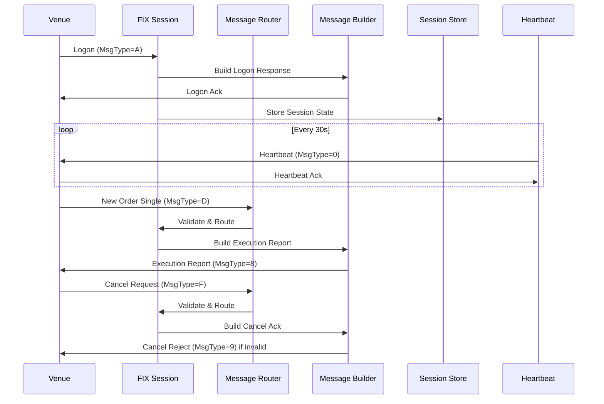
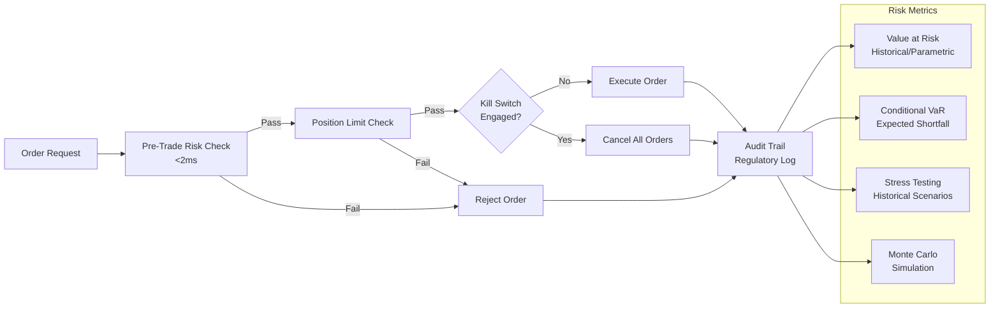
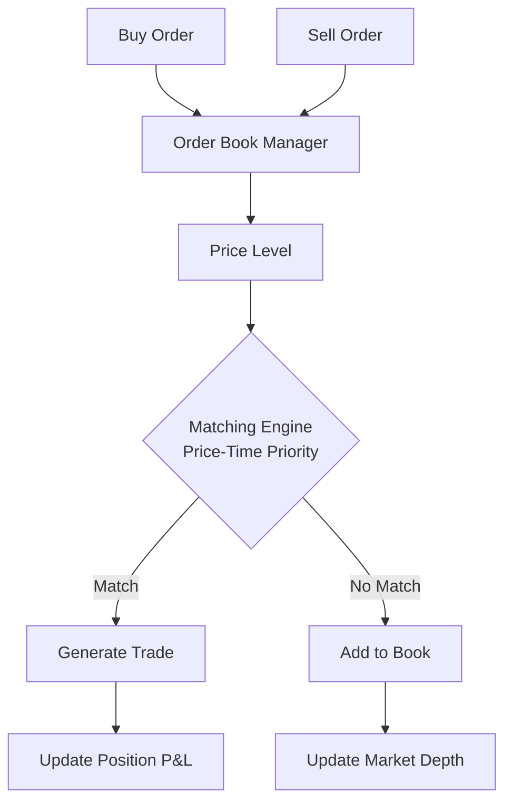
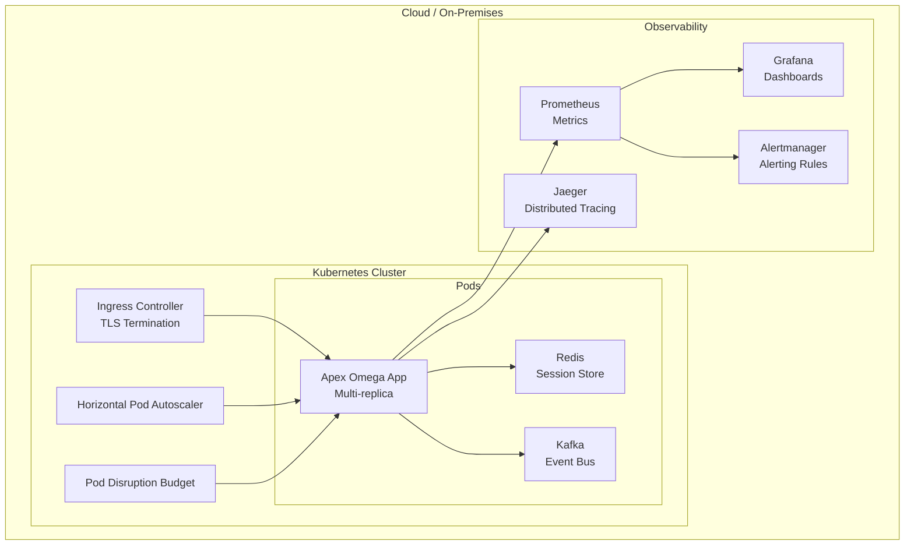

# Apex Omega — FinTech OS

Ultra-low-latency trading infrastructure with FIX protocol, venue connectors, feed handling, order book, and risk engine.

## Architecture

```mermaid
flowchart TD
    subgraph External["External Venues"]
        BBG[Bloomberg B-PIPE]
        EMSX[Bloomberg EMSX]
        MKTX[MarketAxess]
    end

    subgraph FeedLayer["Feed Handler Layer"]
        MV[Multi-Venue Feed Handler\n100K+ events/sec]
        NORM[Feed Normalizer]
        FILTER[Feed Filter]
        STATS[Feed Statistics\nVWAP/TWAP/Volatility]
        LAT[Latency Monitor\nµs precision]
    end

    subgraph FIXLayer["FIX Protocol Layer"]
        F42[FIX 4.2 Session]
        F44[FIX 4.4 Session]
        F50[FIX 5.0 Session]
        ROUTER[FIX Message Router]
        BUILDER[FIX Message Builder]
        STORE[FIX Session Store\nRedis-backed]
        HB[FIX Heartbeat Monitor]
        RESEND[FIX Resend Handler]
        REJECT[FIX Reject Handler]
    end

    subgraph VenueLayer["Venue Connector Layer"]
        SDK[Venue Connector SDK]
        SM[Session Manager]
        OR[Order Router\nSmart Routing]
        MDA[Market Data Aggregator]
        PM[Position Manager]
        EA[Execution Analyzer]
    end

    subgraph OrderBookLayer["Order Book Layer"]
        OBM[Order Book Manager\n10K+ orders/sec]
        PL[Price Level\nO(1) insertion]
        ME[Matching Engine\nPrice-Time Priority]
    end

    subgraph RiskLayer["Risk Engine Layer"]
        PTR[Pre-Trade Risk\n<2ms checks]
        POS[Position Limit]
        KS[Kill Switch\nMiFID II Art 16]
        AUDIT[Risk Audit Trail]
        VAR[VaR/CVaR\nMonte Carlo]
        STRESS[Stress Testing]
    end

    subgraph CoreLayer["Core Infrastructure"]
        ORCH[Core Orchestrator]
        CFG[Config Manager\nYAML/TOML/JSON]
        LOG[Logging Framework\nStructured JSON]
        MET[Metrics Collector\nPrometheus]
        HC[Health Check\nReadiness/Liveness]
        TR[Distributed Tracing]
        SLA[SLA Monitoring\nBurn Rate]
        FF[Feature Flags\nA/B Testing]
    end

    subgraph SecurityLayer["Security Layer"]
        ZT[Zero-Trust\nmTLS/SPIFFE]
        AUTHZ[RBAC/ABAC\nPolicy Engine]
        SEC[Secrets Management\nVault]
        REG[Regulatory Reporting\nMiFID II RTS 22]
    end

    subgraph InfraLayer["Infrastructure"]
        DOCKER[Docker\nMulti-stage]
        K8S[Kubernetes\nHPA/Ingress/PDB]
    end

    BBG --> MV
    EMSX --> MV
    MKTX --> MV
    MV --> NORM --> FILTER --> STATS
    MV --> LAT

    F42 --> ROUTER
    F44 --> ROUTER
    F50 --> ROUTER
    ROUTER --> BUILDER
    ROUTER --> STORE
    ROUTER --> HB
    ROUTER --> RESEND
    ROUTER --> REJECT

    SDK --> SM --> OR
    OR --> MDA
    OR --> PM
    OR --> EA

    OBM --> PL --> ME

    PTR --> POS
    PTR --> KS
    KS -->|No| EXEC[Execute Order]
    KS -->|Yes| CANCEL[Cancel All Orders]
    PTR -->|Fail| REJECT[Reject Order]
    POS -->|Fail| REJECT
    EXEC --> AUDIT
    CANCEL --> AUDIT
    REJECT --> AUDIT

    ORCH --> CFG
    ORCH --> LOG
    ORCH --> MET
    ORCH --> HC
    ORCH --> TR
    ORCH --> SLA
    ORCH --> FF

    ZT --> AUTHZ
    ZT --> SEC
    ZT --> REG

    DOCKER --> K8S
```

## FIX Protocol Flow



## Risk Engine Pipeline



## Order Book Matching



## Deployment Architecture



## Benchmark Comparisons

| Feature | Apex Omega | Murex | Calypso | Bloomberg | ION |
|---------|-----------|-------|---------|-----------|-----|
| FIX Protocol | 4.2/4.4/5.0 | 4.2/4.4 | 4.2/4.4 | Proprietary | 4.2/4.4 |
| Latency | <1ms | <1ms | <5ms | <10ms | <2ms |
| Order Book | 10K+ orders/sec | 5K/sec | 3K/sec | N/A | 8K/sec |
| Risk Engine | Pre-trade <2ms | Pre-trade <5ms | Pre-trade <10ms | N/A | Pre-trade <5ms |
| Venue Connectors | Bloomberg, MarketAxess | Multi-venue | Multi-venue | Bloomberg only | Multi-venue |
| Docker + K8s | ✅ | ❌ | ❌ | ❌ | ❌ |
| Open Source | AGPL-3.0 | ❌ | ❌ | ❌ | ❌ |
| LLM-Agnostic | ✅ | ❌ | ❌ | ❌ | ❌ |
| Regulatory Reporting | MiFID II RTS 22 | MiFID II | MiFID II | N/A | MiFID II |

## Tests

~1,861 tests, TDD-enforced.

## License

AGPL-3.0
